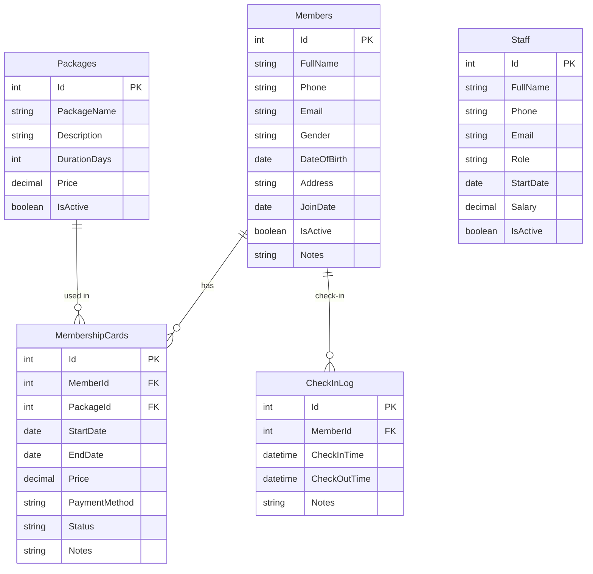

# 🏋️‍♂️ GymApp - Gym Management System

[](https://dotnet.microsoft.com/download)
[](https://docs.microsoft.com/en-us/dotnet/desktop/wpf/)
[](https://www.oracle.com/database/)

> A modern gym management system built with WPF and Oracle Database. Comprehensive solution for managing members, memberships, staff, and analytics reporting.

## 📋 Table of Contents

- [🌟 Key Features](#-key-features)
- [🏗️ System Architecture](#️-system-architecture)
- [⚡ Quick Setup](#-quick-setup)
- [📊 Database](#-database)
- [🖼️ User Interface](#️-user-interface)
- [🔧 Configuration](#-configuration)
- [📚 Documentation](#-documentation)
- [🤝 Contributing](#-contributing)

## 🌟 Key Features

### 👥 Member Management
- ✅ Add, edit, delete member information
- ✅ Search and filter members
- ✅ Track activity status
- ✅ Manage detailed personal information

### 💳 Membership Management
- ✅ Create new membership cards
- ✅ Automatic/manual membership renewal
- ✅ Expiration tracking and alerts
- ✅ Manage different package types

### 📦 Package Management
- ✅ Create and edit workout packages
- ✅ Set duration and pricing
- ✅ Enable/disable packages
- ✅ Package usage statistics

### 👨‍💼 Staff Management
- ✅ Manage staff information
- ✅ Role-based permissions
- ✅ Salary and work time tracking
- ✅ Employment status management

### 📊 Dashboard & Reports
- ✅ Real-time statistics overview
- ✅ Monthly revenue tracking
- ✅ Active member analysis
- ✅ Membership expiration alerts

### 🔐 Security & Authentication
- ✅ Secure login system
- ✅ Sensitive data encryption
- ✅ Access control
- ✅ Activity audit logs

### ⚡ Advanced Features
- ✅ Member check-in/check-out
- ✅ Simultaneous member and membership creation
- ✅ Smart filtering and search
- ✅ Report export
- ✅ Data backup/restore

## 🏗️ System Architecture

```
GymApp.csproj
├── 🗂️ Dependencies
├── 📁 Data
│   └── 📄 DbContext.cs
├── 📁 Helpers
│   ├── 📄 Converters.cs
│   └── 📄 RelayCommand.cs
├── 📁 Models
│   ├── 📄 Members_Info.cs
│   ├── 📄 Member.cs
│   ├── 📄 Packages.cs
│   ├── 📄 MembershipCards.cs
│   └── 📄 Staff.cs
├── 📁 ViewModels
│   ├── 📁 Members_Info
│   │   ├── 📄 Members_InfoCreateViewModel.cs
│   │   ├── 📄 Members_InfoEditViewModel.cs
│   │   └── 📄 Members_InfoListViewModel.cs
│   ├── 📁 Member
│   │   ├── 📄 MemberCreateViewModel.cs
│   │   ├── 📄 MemberEditViewModel.cs
│   │   └── 📄 MemberListViewModel.cs
│   ├── 📁 Packages
│   │   ├── 📄 PackagesCreateViewModel.cs
│   │   ├── 📄 PackagesEditViewModel.cs
│   │   └── 📄 PackagesListViewModel.cs
│   ├── 📁 MembershipCards
│   │   ├── 📄 MembershipCardsCreateViewModel.cs
│   │   ├── 📄 MembershipCardsEditViewModel.cs
│   │   └── 📄 MembershipCardsListViewModel.cs
│   ├── 📁 Staff
│   │   ├── 📄 StaffCreateViewModel.cs
│   │   ├── 📄 StaffEditViewModel.cs
│   │   └── 📄 StaffListViewModel.cs
│   ├── 📄 DashboardViewModel.cs
│   └── 📄 LoginViewModel.cs
├── 📁 Views
│   ├── 📁 Members_Info
│   │   ├── 📄 Members_InfoCreateView.xaml/.cs
│   │   ├── 📄 Members_InfoEditView.xaml/.cs
│   │   └── 📄 Members_InfoListView.xaml/.cs
│   ├── 📁 Members
│   │   ├── 📄 MemberCreateView.xaml/.cs
│   │   ├── 📄 MemberEditView.xaml/.cs 
│   │   └── 📄 MemberListView.xaml/.cs
│   ├── 📁 Packages
│   │   ├── 📄 PackagesCreateView.xaml/.cs
│   │   ├── 📄 PackagesEditView.xaml/.cs
│   │   └── 📄 PackagesListView.xaml/.cs
│   ├── 📁 MembershipCards
│   │   ├── 📄 MembershipCardsCreateView.xaml/.cs
│   │   ├── 📄 MembershipCardsEditView.xaml/.cs
│   │   └── 📄 MembershipCardsListView.xaml/.cs
│   ├── 📁 Staffs
│   │   ├── 📄 StaffCreateView.xaml/.cs
│   │   ├── 📄 StaffEditView.xaml/.cs
│   │   └── 📄 StaffListView.xaml/.cs
│   ├── 📄 DashboardView.xaml/.cs
│   └── 📄 LoginView.xaml/.cs
├── 📄 App.xaml/.cs
├── 📄 appsettings.json
├── 📄 AssemblyInfo.cs
└── 📄 MainWindow.xaml/.cs
```

### 🛠️ Technology Stack

| Component | Technology | Version |
|-----------|------------|---------|
| **Framework** | .NET | 8.0 |
| **UI** | WPF (Windows Presentation Foundation) | - |
| **Pattern** | MVVM (Model-View-ViewModel) | - |
| **Database** | Oracle Database | 21c/19c |
| **ORM** | Oracle.ManagedDataAccess.Core | 23.4.0 |
| **Configuration** | Microsoft.Extensions.Configuration | 8.0.0 |

## ⚡ Quick Setup

### 📋 System Requirements

- **OS**: Windows 10/11
- **.NET**: 8.0 SDK or higher
- **Database**: Oracle Database 19c+ or Oracle XE
- **IDE**: Visual Studio 2022 (recommended)

### 🚀 Step 1: Clone Repository

```bash
git clone https://github.com/Hastapkin/GymApp.git
cd GymApp
```

### 🗄️ Step 2: Database Setup

1. **Install Oracle Database** (or use free Oracle XE)

2. **Create User and Schema:**
```sql
-- Connect to Oracle as SYSDBA
CREATE USER C##GymApp IDENTIFIED BY a123;
GRANT CONNECT, RESOURCE, DBA TO C##GymApp;
GRANT UNLIMITED TABLESPACE TO C##GymApp;
```

3. **Import Database Schema:**
```bash
# Connect to Oracle and run GymApp.sql file
sqlplus C##GymApp/a123@localhost:1521/FREE @GymApp.sql
```

### ⚙️ Step 3: Configure Connection String

Edit `appsettings.json` file:

```json
{
  "ConnectionStrings": {
    "OracleConnection": "Data Source=localhost:1521/FREE;User Id=C##GymApp;Password=a123;"
  },
  "Authentication": {
    "Username": "admin",
    "Password": "admin"
  }
}
```

### ▶️ Step 4: Run Application

```bash
# Restore packages
dotnet restore

# Build project
dotnet build

# Run application
dotnet run
```

## 📊 Database

### 🗃️ Database Schema



### 📈 Sample Data

The system comes with sample data:
- **5 Members** with complete information
- **4 Packages** from 1 month to 1 year
- **2 Staff members** with different roles
- **5 Membership cards** with various statuses
- **Sample check-in history**

## 🖼️ User Interface

### 🏠 Dashboard
- Key metrics overview
- Real-time statistics
- Visual charts
- Quick alerts

### 👥 Member Management
- Member list with search functionality
- Add/edit information forms
- Detailed view and history

### 💳 Membership Management
- Membership list with filters
- Create new cards and renewals
- Expiration status tracking

### 🔐 Login
- Modern login interface
- Secure authentication
- Session management

## 🔧 Configuration

### 🔐 Authentication

```json
{
  "Authentication": {
    "Username": "admin",
    "Password": "admin"
  }
}
```

### 🗄️ Database Connection

```json
{
  "ConnectionStrings": {
    "OracleConnection": "Data Source=server:port/service;User Id=username;Password=password;"
  }
}
```
## 📚 Documentation

### 🔧 Development

- **Architecture**: MVVM Pattern with WPF
- **Data Binding**: Two-way binding with INotifyPropertyChanged
- **Commands**: RelayCommand implementation
- **Navigation**: Frame-based navigation
- **Validation**: Input validation with DataAnnotations

### 🗄️ Database

- **Schema**: Normalized design with Foreign Keys
- **Indexes**: Performance optimized
- **Views**: V_MemberInfo for reporting
- **Sequences**: Identity columns for auto-increment

### 🎨 UI

- **Design**: Modern Material Design principles
- **Colors**: Professional color palette
- **Typography**: Clear, readable fonts
- **Responsiveness**: Adaptive layouts

---

<div align="center">

Made with ❤️ by **Hastapkin**

*If this project is helpful, please give me a ⭐!*

</div>
